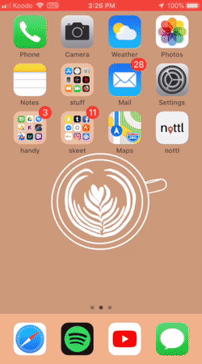

# Location Based Social Media

*Currently under development.*

Leave a note where you are -> see if anyone finds it!
The app restricts users from opening notes > 50m away.

## Completed

### Create Account Page

Users can:
- Register an account via e-mail
- Set profile image
- Create a unique username

Making it work:
- UIGestureRecognizer
- Firebase Atuh
- NotificationCenter
- info.plist permissions
- UIImagePickerController

### Log in

Get logged in with your authorized account.

Making it work:
- Regex matching
- NotificationCenter
- UIGestureRecognizer
- Firebase Auth

### Dropping a Note

Choose an image, choose a caption!
Posted images show up on your profile page.

Making it work:
- Mapkit
- CLLocationManager
- Firebase Database
- Haversine Formula

### Finding a Note

Get within 50m of a note and the image can be revealed!

Making it work:
- Generating background threads (GCD) -> Fetching server data
- URLSession (Fetching images from urls)
- TableViews (Dealing with bugs dequeuing reusable cells)
- Custom Annotations
- Firebase Database

## Incomplete

### Recent Finds Page

Intend to use have notes found in the past 24h here

Will be working with:
- TableViews
- iOS File System
- Firebase Database

### Profile View

Although implemented, need to add:
- Refreshing data at the right time
- Downloading images more efficiently
- Fix improper dequeuing of cells from time to time

